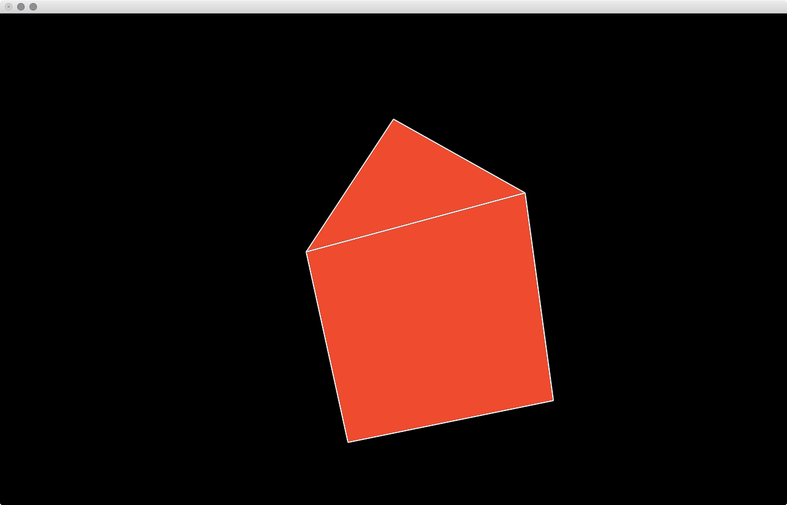
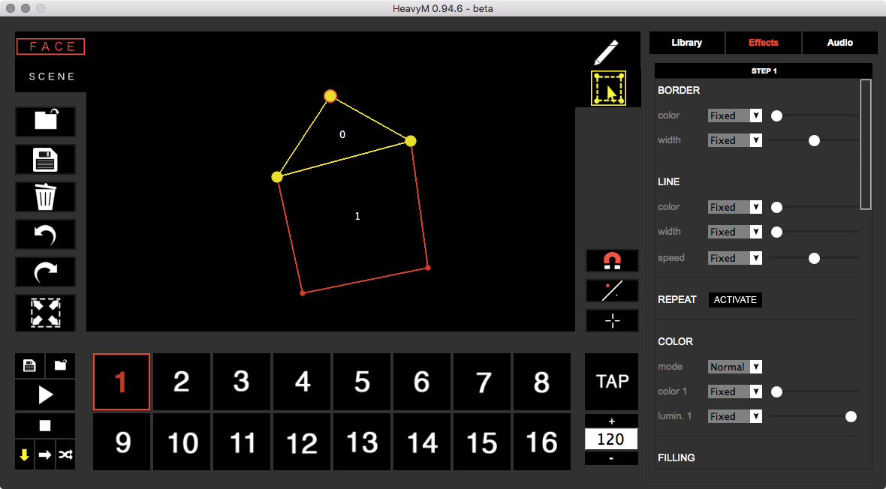
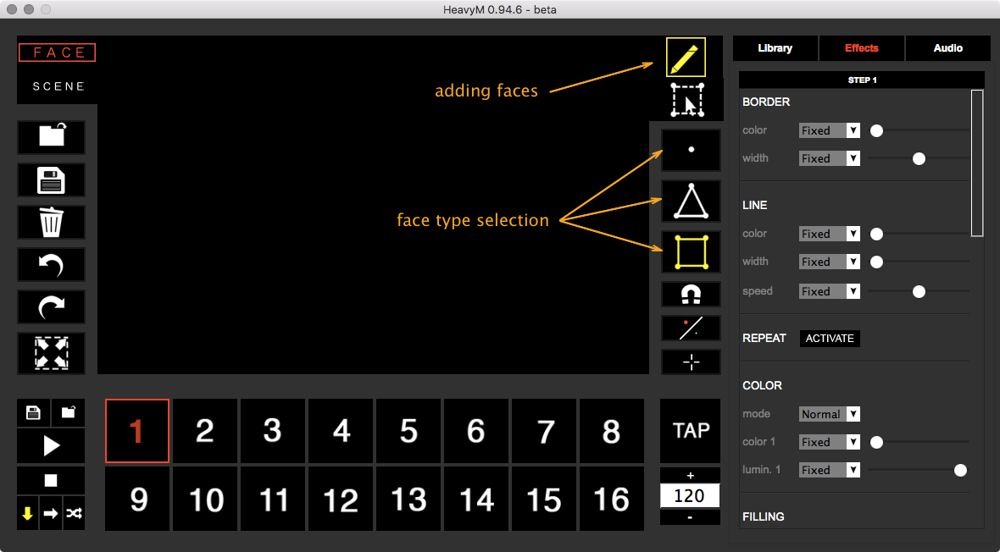
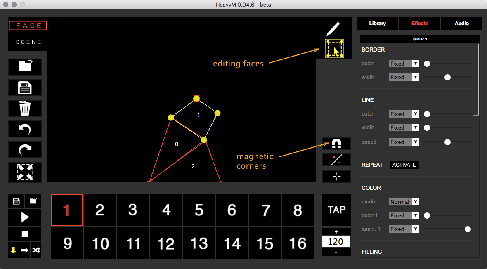
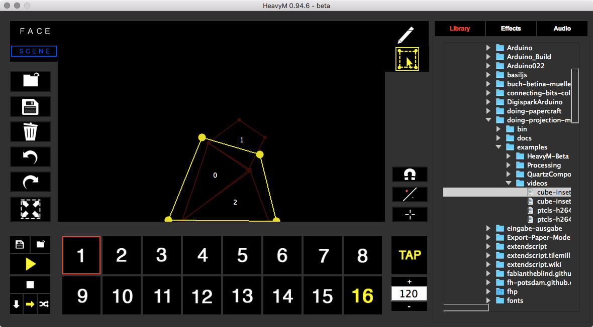

The HeavyM Beta is, as described in the [Workflow section](workflows/) a smaller version of [HeavyM Live](heavym-live/). For a lot of use cases this might be enough.  
The application consists of two windows. The editor and the projection. When starting the application you should send the projection into the fullscreen mode on your projector window. Adjust the position of your projector and keep track of where the projector and your object are.  
For the moment we wont look into audio input but there is the possibility to map the sound of your room to different parameters.  

  
  

### Basic Usage  

Start HeavyM Beta, send the projection window into fullscreen and adjust the position of your object.  

!!!hint
    You should create some markers for the projector and the object so you can set them up again in the same positions.  

#### Adding Faces

To add some faces onto your object you need to select from the toolbar on the right the pen and then below the type of face you want to add.

- Point
- Triangle
- Rectangle

Then just click into the main window. This will add a face of the selected type for each click.  

  

#### Editing Faces  

When you have the desired number of faces change into the face editing mode by selecting the bounding box tool below the pen. This will give you the possibility to adjust the corner points of your faces. Make them match your object. For convenience you can activate the magnetic vertex points so your corners fit nicely.  

  

#### Adding Effects

You can now add effects to your faces (right hand side, between "Library" and "Audio"). There are several possibilities like adding a stroke or a fill. Making it strobe. Adding an old TV look or for example noise. All these effects get applied to each face in your scene. To have different scenes you can switch on the bottom of the window between scenes. Each effect set is defined per scene. With the play button on the left you can start playing through the scenes. The tempo is defined by the BPM set on the right.  

!!! hint
    You can copy paste the whole effect set of one scene to another by right clicking on a scene. There is also the possibility to save a scene into a file and load that file again (on the left side of the scenes row).  

  

#### Adding Media  

To add a video or an image you have to add an overlay object. With the scene tab selected you change into the adding mode (the pen on the toolbar) and click once into the main window. Switch to the editing mode (bounding box below the pen) and make the overlay fit your needs. This will hold the media you are adding. Select the media browser on the right and just drag and drop images or videos onto the overlay.  

!!!note
    ☛ The video will start playing right away.  
    ☛ Unfortunately there is no way to start stop videos. This is the same for the Live version. Hopefully this feature will be added soon.  
    ☛ A H264 compression works fine.  

  

