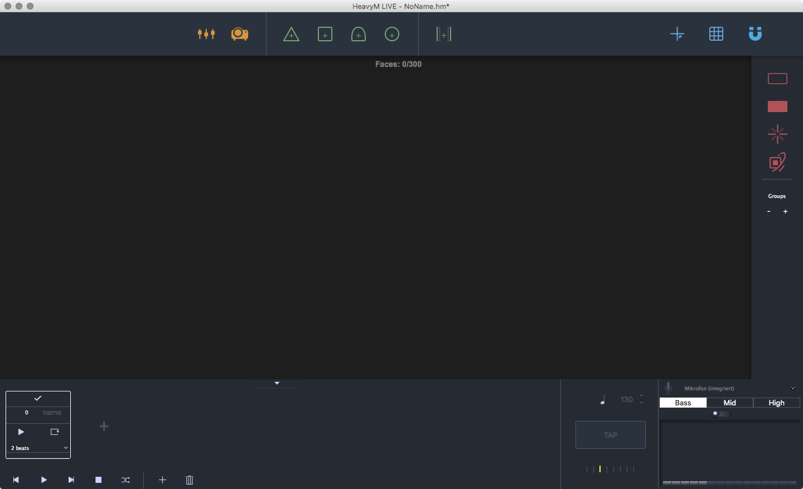
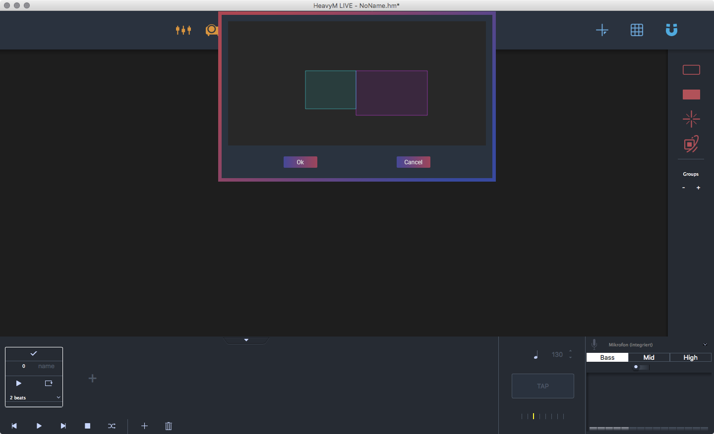
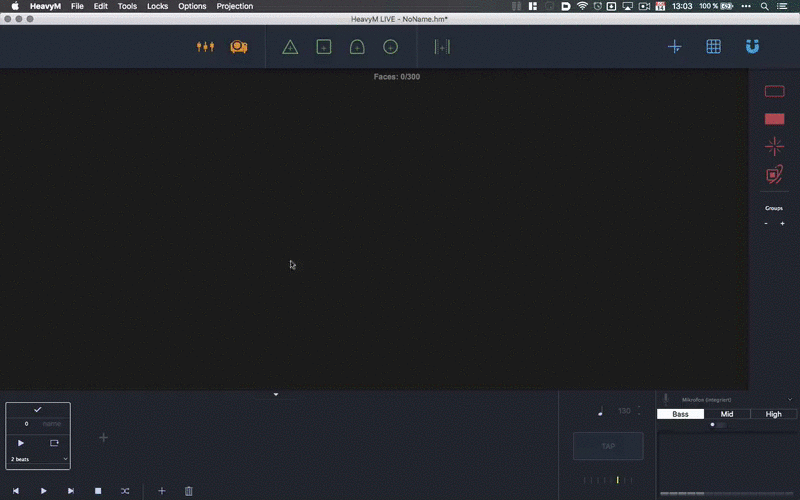
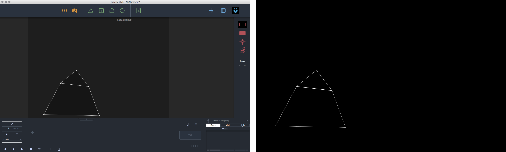
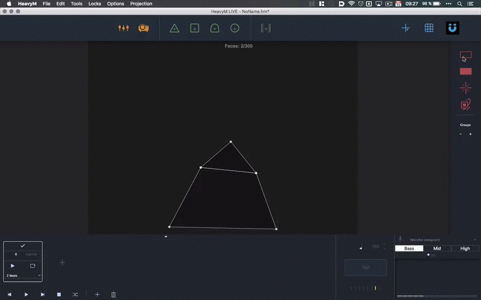
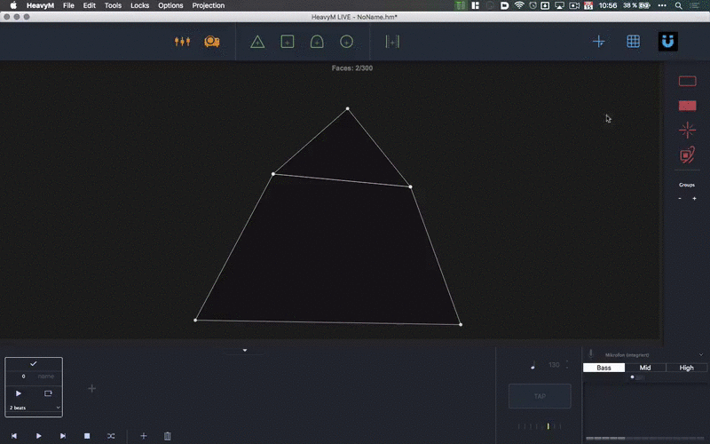
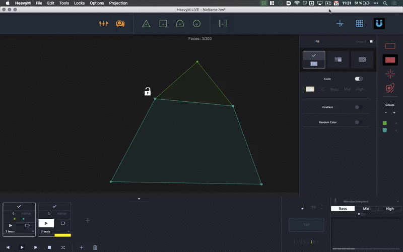

HeavyM Live is the extended version of HeavyM Beta. At this point we want to thank the HeavyM Team again for providing us with some trial licenses for our workshop. It provides a lot more functionality than the Beta version. Connect your projector. After you downloaded and installed HeavyM Live you get the window below on startup.  

  

### Basic Usage

The application consists of two windows. The editor window and the projection window. To get the projection window up and running you need to connect your window and enable your projector by clicking on the projector icon on the top of the window. You will be presented with a screen selection. Select the one that is your secondary screen and hit okay. Your secondary screen should now be a black fullscreen window.  

  

#### Adding Faces  

Now you can now start dragging and droping faces onte the editor window. There are the possibility to add:  

- Triangles
- Rectangles
- Ellipses
- Polygons (free forms)  
- Media overlays (we will look into that in the section [Loading Media](#loading-media))

For easier handling there is button for activating magnetic corners on the faces. it makes your faces snap together and prevents having unwanted holes. Start building your object. You can delete unwanted faces just by selcting them and hitting ⌫ (delete). To move your editor window around you can hold space.  

  

!!!hint
    Don't forget to save your project regulary to prevent data loss.  

| Action                 | Decscription                                            |
| :---                   | :---                                                    |
| right click            | options for copy pasting, deleting and group assignment |
| ⌫                      | deletes the selected face                               |
| Space + Mouse movement | moves the editor area                                   |

#### Adding Effects  

When you are done adding your faces you can add effects to them. As default only the borders are activated. 

  

On the right side of the editor window you find options for, borders, fills, shaders and structure. Explore them at will. For our particular use the fill settings are the most important.  
You can activate or deactivate all the effects by clicking the according icon when the additional panel is expanded. It will have an little ✓ mark when it is activated. See the animation below.  

  

#### Loading Media  

To add video overlays to your faces you need to add a player face into your scene. Drag and drop from the top bar the player object onto your scene. This gives you a rectangular field and opens the media panel on the left side of the window. Hit the little plus sign on the media section and browse for a video.  

!!!note
    We used a H264 compression in a .mov container. If you try other codecs we would be happy to hear from you.  

When the media is loaded and you've adjusted the bounds of your video hit the play button and your video will start playing in an infinite loop. _Currently there is no way to start and stop several videos at once. We hope this will be a feature soon._  
See the animation below.

  

!!!hint
    You need to activate the fill property on the right side for all the faces that should have the video as fill. If you just want the whole video on the screen without being cropped by the faces. Hit the "activate on top" button on top of the panel.  

#### Loading Syphon Input  

To have input from other sources, e.g. After Effects or Processing you just need to follow the instructions in the [Loading Media section](#loading-media). On the media panel on the bottom is a area for Syphon input. Select in the little dropdown menu the Syphon server you have already running and hit the play button. Now you should have the frames of your external application on your object. For further information on using Syphon go to the section [Processing Syphon](processing-syphon/) or [Quartz Composer Syphon](qc-syphon/).  

!!!warning
    Starting the input __without__ having a Syphon server running might crash HeavyM.  

#### Additional Notes  

There are several more things you can do. We only scratched only the surface of HeavyM. (Explore them at will.)  

- Add several scenes to have different configurations for your effects and overlays.  
- Run the scenes per beat.  
- Add a grid to transform all the faces within that grid at once.  
- Assigning faces to groups (allows to have different effect configurations for face groups)
- Locking faces and media overlays(for better handling).  
- Animate borders, lines within the faces shaders and effects.
- Drive effects from audio or midi input.

  

