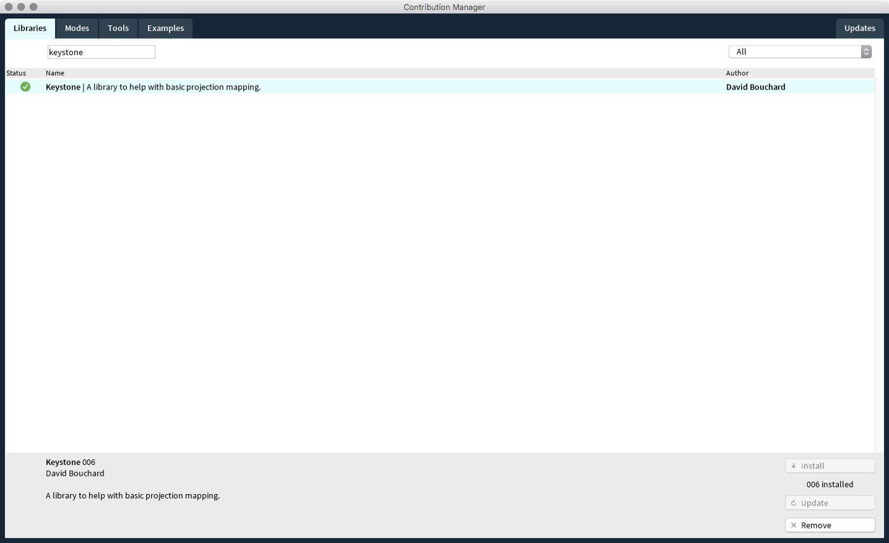
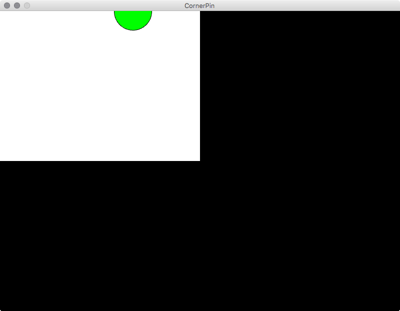
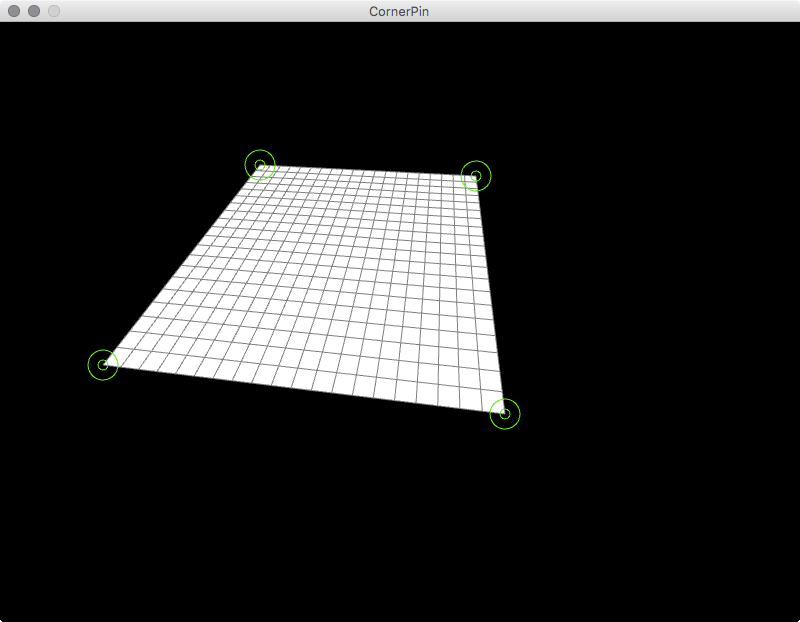
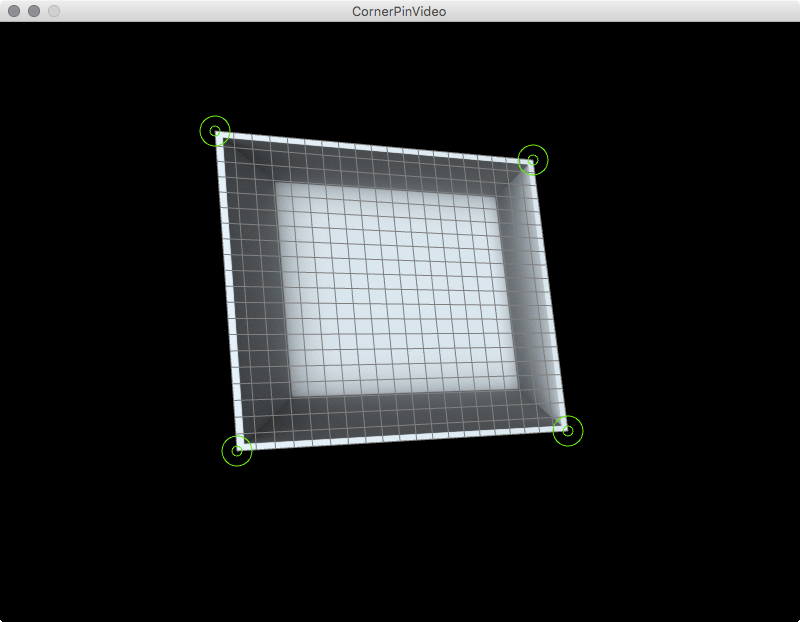
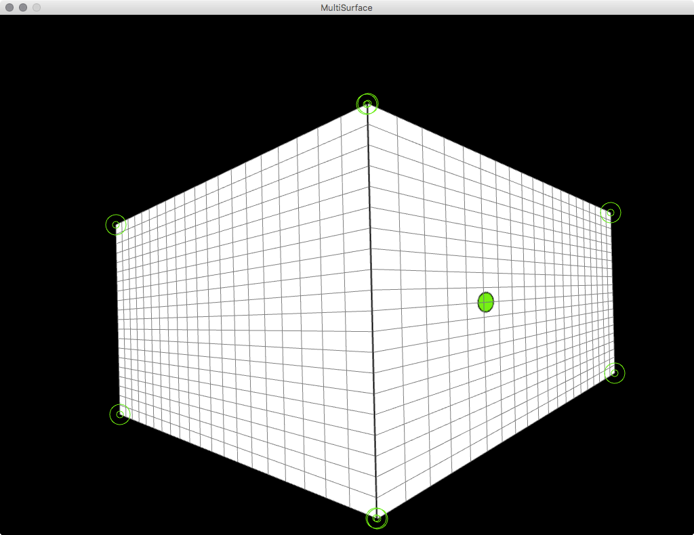

### Processing Setup 

To create a mapping from within processing we will use the [Keystone](http://keystonep5.sourceforge.net/) library. Download and install Processing 3 and go to "Sketch > Import Library… > Add Library". Search in the Library Manager for "keystone". Hit install and restart Processing.  

  

Now you should find under "File > Examples > Contributed Libraries" a folder called Keystone with an example called "CornerPin". 

### Basic Usage  

When running the CornerPin example you will get presented with a simple screen that contains rectangle with a green ellipse on it that follows the mouse (see the image). 

  

First we need to adjust the size of the sketch to our projectors output. Look for following line and put in the width and height of your projector (in that order).

    size(800, 600, P3D);

When running our sketch we now will get a window that fits our output. Run it as a fullscreen window by hitting the enlarge button on the top of it or start the sketch in presentation mode dirctly from Processing.  

| Keycombo  | Description                          |
| :---      | :---                                 |
| ⌘ + R     | runs the sketch                      |
| ⇧ + ⌘ + R | runs the sketch in presentation mode |

The next parameter we need to adjust is the line that creates our corner pin surface. Look for the following line and change the values to a desired size or leave them as is. Depending on what your output should be.  

    surface = ks.createCornerPinSurface(400, 300, 20);

The firs parameter is the `width`, the second the `height` and the third is the `resolution` of the surface. These values need to correspond with the next parameter we need to adjust. 

    offscreen = createGraphics(400, 300, P3D);

This is the size of the graphics we are going to generate within Processing. We don't render anything directly into the window of the application. Instead the library takes a offscreen rendered graphic and distorts this in the cornerpin surface. That means every graphical output of Processing that we want to have distorted needs to be called as a child of the `offscreen` `PGraphics` object. See the [Processing reference](https://processing.org/reference/createGraphics_.html) for further insight.  
The following lines in the sketch get the transformed mouse position and add the graphical output to the offscreen buffer.  

    PVector surfaceMouse = surface.getTransformedMouse();
    offscreen.beginDraw();
    offscreen.background(255);
    offscreen.fill(0, 255, 0);
    offscreen.ellipse(surfaceMouse.x, surfaceMouse.y, 75, 75);
    offscreen.endDraw();

Everything you want on your object needs to be between the lines `offscreen.beginDraw();` and `offscreen.endDraw();`. After that we send the `PGraphics` object to the Keystone surface and render it to the screen with the following line.  

    surface.render(offscreen);

Now you can distort your surface. Hit 'c' and you will get some handles at each corner. for convenience there are two other commands implemented. 's' saves your scene to a .xml file. 'l' loads a scene from that file.

| Key  | Description     |
| :--- | :---            |
| s    | save scene      |
| l    | load scene      |
| c    | edit cornerpins |

  

Thats mostly it. If you want to map several surfaces you just need to:  

1. create a PGraphics object for each surface
2. create a CornerPinSurface object for each surface
3. initialize them 
4. draw to your offscreen buffers
5. add them all to the `surface.render(PGraphics)` command.  

### Examples  

In the repository you can find three examples for processing. To run them you need to [download](https://github.com/FH-Potsdam/doing-projection-mapping/archive/master.zip) the whole folder and open the .pde files in Processing. See the examples/Processing/Keystone directory for the sketches.  

#### Ex. CornerPin

This is the basic example taken from the Keystone library. It distorts one surface as explained above.  

| Key  | Description          |
| :--- | :---                 |
| s    | save scene           |
| l    | load scene           |
| c    | edit cornerpins      |

Read the source code [here](https://github.com/FH-Potsdam/doing-projection-mapping/blob/master/examples/Processing/Keystone/CornerPin/CornerPin.pde).  

#### Ex. CornerPinVideo

This example shows how to use a video inside of your surface. You can play/pause it by hitting "p".  

  

| Key  | Description          |
| :--- | :---                 |
| s    | save scene           |
| l    | load scene           |
| c    | edit cornerpins      |
| p    | play/pause the video |

Read the source code [here](https://github.com/FH-Potsdam/doing-projection-mapping/blob/master/examples/Processing/Keystone/CornerPinVideo/CornerPinVideo.pde).  

#### Ex. CornerPinMultiSurface

The MultiSurface example shows the usage of two surfaces that build a corner. All the key strokes from the CornerPin examples apply.  

  

| Key  | Description          |
| :--- | :---                 |
| s    | save scene           |
| l    | load scene           |
| c    | edit cornerpins      |

Read the source code [here](https://github.com/FH-Potsdam/doing-projection-mapping/blob/master/examples/Processing/Keystone/CornerPinMultiSurface/CornerPinMultiSurface.pde).  

### Keystone Reference  

For an deeper insight into the Keystone library. Go to [keystonep5.sourceforge.net/reference/index.html](http://keystonep5.sourceforge.net/reference/index.html).  
