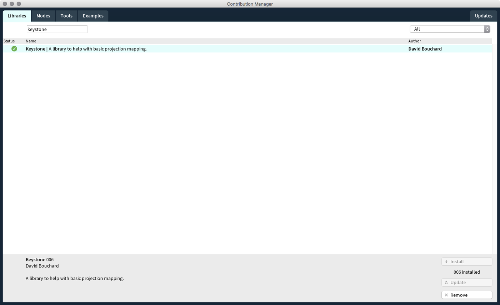

To create a mapping from within processing we will use the Keystone library. Download and install Processing 3 and go to "Sketch > Import Library… > Add Library". Search in the Library Manager for "keystone". Hit install and restart Processing.  

  

### Basic Usage  

