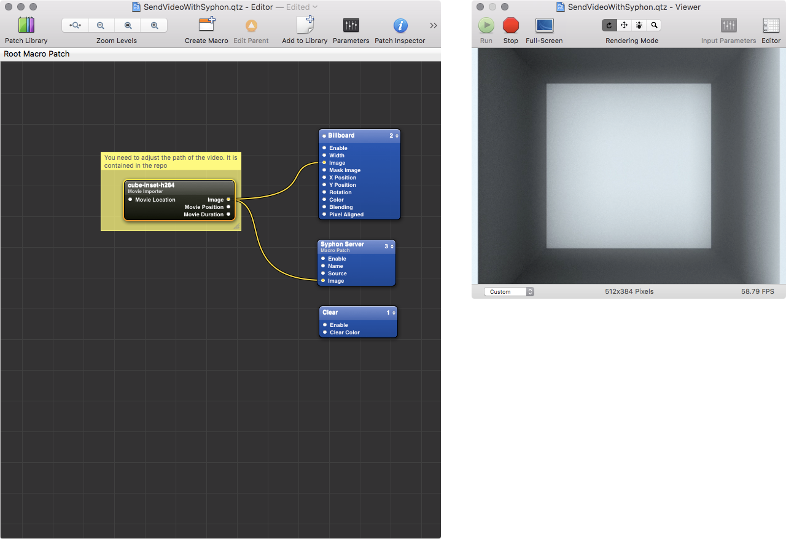

### Quartz Composer Setup  

>Quartz Composer is a node-based visual programming language provided as part of the Xcode development environment in Mac OS X for processing and rendering graphical data.
>Quartz Composer uses OpenGL (including GLSL), OpenCL (only in Mac OS X 10.6 and later), Core Image, Core Video, JavaScript, and other technologies to build an API and a developer tool around a simple visual programming paradigm. Apple has embedded Quartz technologies deeply into the operating system. Compositions created in Quartz Composer can be played standalone in any QuickTime-aware application (although only on Mac OS X 10.4 and later), as a system Screen Saver, as an iTunes Visualizer, from inside the Quartz Composer application, or can be embedded into a Cocoa or Carbon application via supplied user interface widgets. Because Quartz Composer makes extensive use of hardware acceleration and pixel shaders, it is recommended to have a graphics card with at least 32 MB of memory. While Quartz Composer is included with the iPhone SDK, as of December 2015 there is no way of running Quartz Compositions on iOS devices.  

[from wikipedia.org](https://en.wikipedia.org/wiki/Quartz_Composer)

We wont go into depth with this setup (for now). It just included to give you an impression of what is possible with other applications. Use it as a starting point when you are into. QC. The process is nearly the same as with processing. Generate your output and pass the frames to the Syphon Server patch. Of course you need to install the [QC modules](https://github.com/Syphon/Quartz-Composer/releases/tag/4) first. The .qtz file shown below is provided within the [examples](https://github.com/FH-Potsdam/doing-projection-mapping/tree/master/examples/QuartzComposer).  

  

