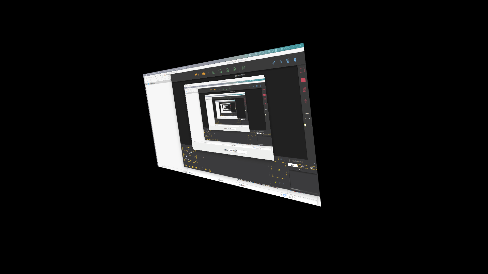

There might the the wish to use applications that are not Syphon enabled. For this we can use [Screener](https://github.com/pizthewiz/Screener). Screener is a OSX application for capturing whole screens.  

THe application needs to be compiled with XCode on your machine.  

  

More to come…  