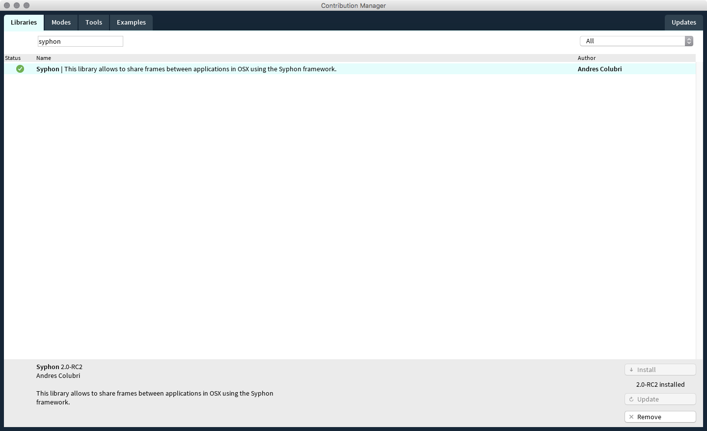

Syphon is a technology that allows applications to share frames. In our example we will use Processing to send simple animations to HeavyM. You have always a "Syphon Server" and a "Syphon Client". In our case the server is our Processing applet and the client is HeavyM.  

### Processing Setup  

To send frames from  Processing we will use the Syphon library. Download and install Processing 3 and go to "Sketch > Import Library… > Add Library". Search in the Library Manager for "Syphon". Hit install and restart Processing.  

  

####SendScreen

This example is the same as provided by the libraries author. It sends the whole screen to the client.  

!!!note
    There are currently some openGL problems with this sketch und Processing 3. When trying to send video images and textured 3D PShapes to the client it does not generate any output on the clinet side. If you want video or textured PShapes take a look at the SyphonMoviePlayer example.  

#### SyphonMoviePlayer

### Quartz Composer Setup  

###HeavyM Live Setup  